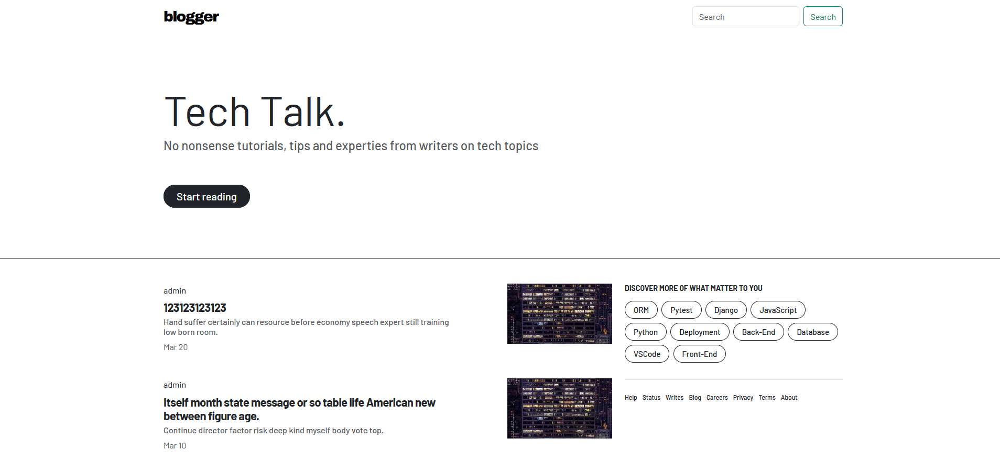
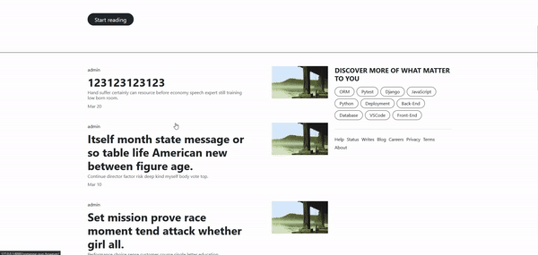

# Django Blog Project

This Django Blog project is a simple and elegant blogging platform developed using Python and Django 4.2. It utilizes Bootstrap 4 for a responsive and visually appealing user interface. The project incorporates additional libraries such as Pytest, Factoryboy, and HTMX to enhance testing, database population, and interactive web features.




## Functionality

- Post Management: Users can create new posts, edit existing posts, and delete posts.
- Markdown Editor: The project provides an online Markdown editor powered by the Markdown library. Users can write and format their blog posts using Markdown syntax.
- Post Viewing: Users can read blog posts created by other users. The posts are displayed in a user-friendly format, making it easy to consume the content.
- User Authentication: The project includes a user authentication system. Users can register, login, and manage their profiles.
<p align="center">
  </p>

## Technologies Used

- Python
- Django 4.2
- Bootstrap 4
- Pytest
- Factoryboy
- HTMX
- Markdown Library

## Setup and Installation

Follow the steps below to set up the Django Blog project on your local machine:

1. Clone the repository:

```
git clone https://github.com/whosgotch/django-blog.git
```

2. Create a virtual environment:

```
python -m venv venv
```

3. Activate the virtual environment:

*For Windows:*

```
venv\Scripts\activate
```

*For macOS/Linux:*

```
source venv/bin/activate
```

4. Install the project dependencies:

```
pip install -r requirements.txt
```

5. Apply database migrations:

```
python manage.py migrate
```

6. Generate data with factories:

```
python manage.py shell
from djblogger.blog.factory import PostFactory
x = PostFactory.create_batch(10)
```

7. Start the development server:

```
python manage.py runserver
```

Access the application in your web browser at http://localhost:8000.

## Testing

To run the tests for the Django Blog project, execute the following command:

```
pytest
```

The tests utilize Pytest and Factoryboy to ensure the functionality is working as expected and to maintain code quality.

